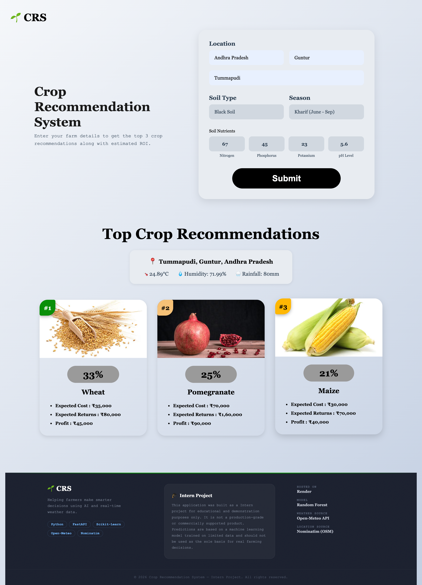

# Crop Recommendation System

An intelligent crop recommendation system that uses Machine Learning to suggest the most suitable crops based on soil nutrients and environmental conditions.By which farmers can save themselves from facing a huge loss due to less crop yield.

## Features

- **ML-Powered Predictions**: Uses trained models to recommend optimal crops
- **User-Friendly Interface**: Clean and responsive frontend design
- **Real-time API**: FastAPI backend for quick predictions
- **Data-Driven**: Built on comprehensive agricultural datasets

## Tech Stack

**Frontend:**
- HTML5
- CSS3
- JavaScript

**Backend:**
- FastAPI
- Python 3

**Machine Learning:**
- Scikit-learn
- Pickle models (.pkl)
- Custom encoders
- Random Forest Classifier

## Project Structure
```
├── frontend/          # Frontend files (HTML, CSS, JS)
│   ├── index.html
│   ├── styles.css
│   └── script.js
├── backend/           # FastAPI backend
│   ├── ML/
│   │   ├── models/    # Trained ML models (.pkl files)
│   │   └── data/      # Training datasets
│   ├── main.py        # FastAPI application
│   └── requirements.txt
└── README.md
```

## Live Demo

- **Frontend**: [Deployed on Render]
- **Backend API**: [Deployed on Render]
- **Link**: https://crop-recommendation-system-hc9x.onrender.com/

## Local Development
To run the project locally, follow these steps:

### Clone the Repository
```bash
git clone https://github.com/teambinfosys/Crop_Recommendation_System.git
```
### Navigate to the project directory
```bash
cd Crop_Recommendation_System
```
### Run Frontend
```bash
cd frontend
```
```bash
python3 -m http.server 8000
```
### Backend Setup in other terminal
```bash
cd backend
```
```bash
pip install -r requirements.txt
```
```bash
uvicorn main:app --reload
```

### Frontend Setup
Simply open `frontend/index.html` in your browser or use a local server.

## Model Information

The system uses ML models trained on agricultural data to predict suitable crops based on:
- Nitrogen (N) content
- Phosphorus (P) content
- Potassium (K) content
- Temperature
- Humidity
- pH value
- Rainfall
- season
- soil type

## 📸 Project Screenshots

### 🏠 Home Page



## Contributing

Contributions are welcome! Feel free to submit issues and pull requests.

## 👥 Team
- **Member 1**: [Shaik Khaja](https://github.com/khaja-shaik-21)
- **Member 2**: [Muskan Yadav](https://github.com/muskanyadav28)
- **Member 3**: [Priya Tiwari](https://github.com/2110priyatiwari)
- **Member 4**: [Murali Krishna](https://github.com/your-github-profile)

---

⭐ Star this repo if you find it helpful!
